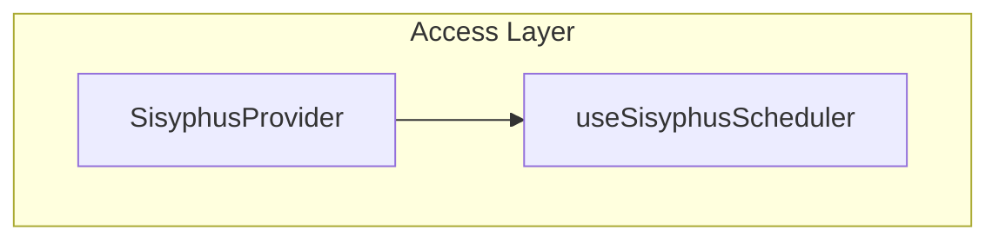

# `@sisyphus/react`

`@sisyphus/react` is the thin React binding for `@sisyphus/core`. It provides a context provider and a hook to access the `RuleWorkspaceScheduler`. It does not render any UI — all rendering is owned by concrete component-library adapters such as `@sisyphus/antd`.

## Prerequisites

- [Core spec](../core/spec.md)

## Technology Stack

- [React 19](https://github.com/facebook/react)
- [@unsignal/react](https://www.npmjs.com/package/@unsignal/react) reactive binding

## Design Goals

- Provide a minimal React context and hook to access the core scheduler.
- Stay free of any component-library or rendering assumptions.
- Let concrete adapter packages (e.g. `@sisyphus/antd`) own all rendering responsibilities.

## Design Principles

- `@sisyphus/core` provides the business schedulers and remains framework free.
- `@sisyphus/react` provides the React context and hook to access the scheduler, but does not depend on any specific component library and does not render any UI.
- Component-library adapter packages, such as `@sisyphus/antd`, implement the concrete UI and consume the scheduler directly from context or props.

## Signal Integration

Reactive updates are handled by `@unsignal/react` at runtime. Components that read `Signal.value` must be wrapped with `observer` to automatically subscribe to signal changes.

```tsx
import { observer } from '@unsignal/react';

const ExampleView = observer(function ExampleView(props: ExampleViewProps): ReactElement {
  const canAdd = props.scheduler.canAdd.value;

  return <button disabled={!canAdd}>Add</button>;
});
```

### Conventions

- Any component that reads `Signal.value` must be wrapped with `observer` from `@unsignal/react`.
- Do not rely on Babel transforms; the `observer` wrapper works with any build tool.

## Architecture

`@sisyphus/react` has a single layer — the **Access Layer** — that exposes a context provider and a hook for the core scheduler.



There is no view registry, no plugin protocol, and no renderer. The application creates the scheduler via `@sisyphus/core`, provides it through `SisyphusProvider`, and concrete adapter components read it through `useSisyphusScheduler` or receive it as a prop.

## Access Layer

### `SisyphusProvider`

Provides the `RuleWorkspaceScheduler` to descendant components through React context.

```ts
interface SisyphusProviderProps {
  readonly scheduler: RuleWorkspaceScheduler;
  readonly children: React.ReactNode;
}

function SisyphusProvider(props: SisyphusProviderProps): ReactElement;
```

### `useSisyphusScheduler`

Returns the current `RuleWorkspaceScheduler` from React context.

```ts
function useSisyphusScheduler(): RuleWorkspaceScheduler;
```

If the hook is used outside `SisyphusProvider`, it throws a framework error.

## Usage Example

The application creates the scheduler via `@sisyphus/core`, provides it through `SisyphusProvider`, and renders the adapter component:

```tsx
import { SisyphusProvider } from '@sisyphus/react';
import { RuleWorkspaceEditor } from '@sisyphus/antd';

function App() {
  const scheduler = createRuleWorkspaceScheduler(/* ... */);

  return (
    <SisyphusProvider scheduler={scheduler}>
      <RuleWorkspaceEditor />
    </SisyphusProvider>
  );
}
```

Adapter components can access the scheduler from context:

```tsx
import { useSisyphusScheduler } from '@sisyphus/react';
import { observer } from '@unsignal/react';

const RuleWorkspaceEditor = observer(function RuleWorkspaceEditor(): ReactElement {
  const scheduler = useSisyphusScheduler();
  // render the workspace UI using the scheduler
});
```

## Public API Boundaries

The intended public surface of `@sisyphus/react` is:

- `SisyphusProvider`
- `SisyphusProviderProps`
- `useSisyphusScheduler`

The following are internal implementation details and should not be treated as stable public API:

- context implementation details
