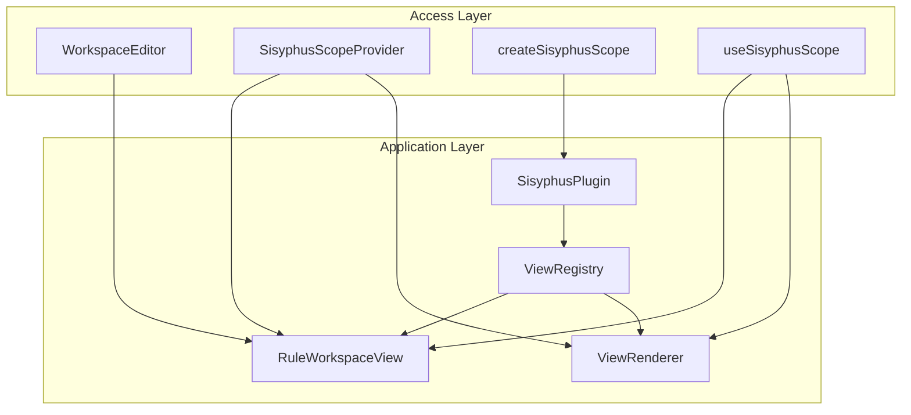

# `@sisyphus/react`

`@sisyphus/react` is the framework adapter layer for Sisyphus. It exposes a small React-facing access API and a plugin lifecycle that lets component-library adapters register the workspace editor implementation.

## Prerequisites

- [Rule factor specification](../spec.md)
- [Rule factor interpreter](../interpreter.md)
- [Core spec](../core/spec.md)

## Technology Stack

- [React 19](https://github.com/facebook/react)
- [@unsignal/react](https://www.npmjs.com/package/@unsignal/react) reactive binding

## Design Goals

- Keep the framework adapter free of component-library assumptions.
- Keep the public access API small and stable.
- Allow component-library packages to register the workspace editor implementation without coupling the framework layer to a specific UI library.
- Preserve a compositional editor hierarchy inside the adapter package.

## Design Principles

- `@sisyphus/core` provides the business schedulers and remains framework free.
- `@sisyphus/react` provides the React integration and plugin protocol, but does not depend on any specific component library.
- Component-library adapter packages, such as `@sisyphus/antd`, provide the workspace editor implementation and register it with the React scope.
- Editor components consume schedulers directly and do not depend on the original DSL.

## Signal Integration

Reactive updates are handled by `@unsignal/react` at runtime. Editor components are wrapped with `observer` to automatically subscribe to signal changes.

```tsx
import { observer } from '@unsignal/react';

const ExampleView = observer(function ExampleView(props: ExampleViewProps): ReactElement {
  const canAdd = props.scheduler.canAdd.value;

  return <button disabled={!canAdd}>Add</button>;
});
```

### Conventions

- Any component that reads `Signal.value` must be wrapped with `observer` from `@unsignal/react`.
- Do not rely on Babel transforms; the `observer` wrapper works with any build tool.

## Architecture

`@sisyphus/react` is split into two layers:

- `Access Layer`: the public React-facing API used by applications.
- `Application Layer`: the generic editor-view protocol and the rendering bridge used by adapter packages.



## Application Layer

The application layer defines a single workspace-level rendering protocol. The framework adapter owns the protocol, while component-library adapters provide the concrete workspace editor implementation.

### Editor View Slot

The framework defines one public editor view slot:

- `RuleWorkspaceView`

The slot name identifies the rendering target, not a concrete UI implementation. The framework layer uses it to route rendering to the component-library adapter.

### View Props

The workspace editor receives only the workspace scheduler. The component identity does not need to be repeated in props.

```ts
interface RuleWorkspaceViewProperties {
  readonly scheduler: RuleWorkspaceScheduler;
}

type EditorViewProperties = RuleWorkspaceViewProperties;
```

### View Registry

The React scope maintains a registry of concrete workspace editor implementations. Adapter packages register the component they provide.

```ts
interface ViewRegistry {
  registerRuleWorkspaceView(component: ComponentType<RuleWorkspaceViewProperties>): void;
}
```

The registry is intentionally narrow:

- it registers one component for the workspace slot
- later registrations replace earlier ones
- it does not expose component-library-specific configuration

### Plugin Protocol

Component-library adapters extend the React scope through a plugin protocol.

```ts
interface SisyphusContext {
  readonly registry: ViewRegistry;
}

interface SisyphusPlugin {
  readonly name: string;
  onRegister(context: SisyphusContext): void;
}
```

Responsibilities of a component-library adapter package:

- implement the concrete UI for the workspace editor slot
- register those views through the plugin protocol
- keep all component-library-specific details outside `@sisyphus/react`

## Access Layer

The access layer is the only part of `@sisyphus/react` intended for direct application use. It hides the registry mechanics behind a small API.

### `createSisyphusScope`

Creates a React scope and installs all supplied plugins.

```ts
interface SisyphusScopeOptions {
  readonly plugins: readonly SisyphusPlugin[];
}

interface SisyphusScope {
  renderer(): ViewRenderer;
}

function createSisyphusScope(options: SisyphusScopeOptions): SisyphusScope;
```

The returned scope is stable and can be reused across renders.

### `SisyphusScopeProvider`

Provides the scope to descendant components through React context.

```ts
interface SisyphusScopeProviderProps {
  readonly scope: SisyphusScope;
  readonly children: React.ReactNode;
}

function SisyphusScopeProvider(props: SisyphusScopeProviderProps): ReactElement;
```

### `useSisyphusScope`

Returns the current scope from React context.

```ts
function useSisyphusScope(): SisyphusScope;
```

If the hook is used outside `SisyphusScopeProvider`, it throws a framework error.

### `WorkspaceEditor`

`WorkspaceEditor` is the only top-level editor component the application needs to know.

```ts
interface WorkspaceEditorProps {
  readonly workspace: RuleWorkspaceScheduler;
}

function WorkspaceEditor(props: WorkspaceEditorProps): ReactElement;
```

`WorkspaceEditor` renders the workspace slot internally and does not expose lower-level editor views to the application.

## Rendering Flow

1. The application creates a scope with `createSisyphusScope()`.
2. The application provides the scope through `SisyphusScopeProvider`.
3. The component-library adapter plugin registers concrete editor views.
4. `WorkspaceEditor` renders `RuleWorkspaceView`.
5. `RuleWorkspaceView` resolves the concrete component from the scope registry and delegates rendering to the adapter implementation.

## Usage Example

The application only depends on the access-layer API:

```tsx
import { createSisyphusScope, SisyphusScopeProvider, WorkspaceEditor } from '@sisyphus/react';
import { createAntdPlugin } from '@sisyphus/antd';

const scope = createSisyphusScope({
  plugins: [createAntdPlugin()],
});

function App() {
  return (
    <SisyphusScopeProvider scope={scope}>
      <WorkspaceEditor workspace={workspace} />
    </SisyphusScopeProvider>
  );
}
```

## Public API Boundaries

The intended public surface of `@sisyphus/react` is:

- `createSisyphusScope`
- `SisyphusScopeProvider`
- `useSisyphusScope`
- `WorkspaceEditor`
- `SisyphusPlugin` for adapter authors
- `RuleWorkspaceViewProperties` for adapter authors

The following are internal implementation details and should not be treated as stable public API:

- concrete registry implementation classes
- context implementation details
- plugin wiring internals
- adapter-local nested UI composition

## Implementation Notes

- Keep editor views focused on rendering only.
- Keep component-library-specific logic inside adapter packages.
- Keep the access layer as small as possible so the application never needs to know how concrete UI components are registered.
