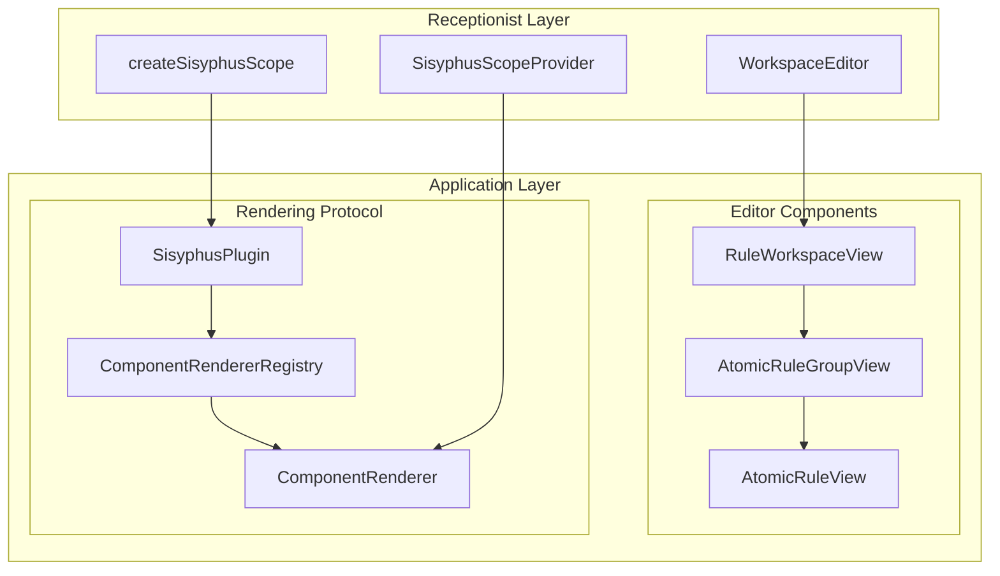

# `@sisyphus/react`

As the **framework adapter layer**, it is responsible for proxy-rendering the encapsulated logic provided by `@sisyphus/core` into concrete `UI` components.

## Prerequisites

- [Rule factor specification](../spec.md)
- [Rule factor interpreter](../interpreter.md)
- [Core spec](../core/spec.md)

## Technology Stack

- [react19](https://github.com/facebook/react)
- [@preact/signals-react](https://github.com/preactjs/signals/tree/main/packages/react) signal binding

## Design Goals

- **Clear component-library adaptation protocol**: define the contract between the framework and the component-library adapter package.
- **Clear editor-component rendering mechanism**: decouple the framework from the concrete `UI` implementation through a plugin proxy mechanism.
- **Clear layered architecture**: distinguish the access layer used directly by the application from the application layer that implements internal components.
- **Composition Pattern**: organize the editor-component hierarchy through composition rather than inheritance.

## Design Conventions

- Reactive integration is based on `@preact/signals-react` and is treated as a runtime standard rather than part of the layered architecture. Editor components consume `Signal` directly.
- Editor components are unrelated to the original `DSL` and consume only the schedulers provided by `@sisyphus/core`.
- Editor components use the `View` suffix.

### Signal Reactive Integration

Editor components use `@preact/signals-react` to implement reactive updates from Signal to React. They use manual `useSignals()` calls to enable signal tracking:

```tsx
import { useSignals } from '@preact/signals-react/runtime';

function EditorComponent({ scheduler }: EditorComponentProps): ReactElement {
  // Must be called at the top of the component to enable Signal dependency tracking
  useSignals();

  // When Signal.value is read, the component automatically subscribes to changes and re-renders
  const value = scheduler.someSignal.value;
  // ...
}
```

**Important conventions**:

- All components that read `Signal.value` must call `useSignals()` at the top of the function body.
- Do not rely on Babel transforms so that it works in any build tool.
- `useSignals()` must be called before any `Signal.value` reads.

## Layered Architecture

- **Access layer**: exposes components and `API`s that are directly used by the application, encapsulating the implementation details of internal editor components and reducing integration cost.
- **Application layer**: defines the editor-component protocol and rendering mechanism, and collaborates with the component-library adapter package through the plugin protocol to complete actual rendering.



### Application Layer

The application layer defines the editor-component protocol and rendering mechanism. The editor components themselves do not hold concrete `UI` implementations; the component-library adapter package registers concrete implementations through the plugin protocol.

#### Editor Components

Editor components are the smallest structural units in the rule-editing view hierarchy and are used as plugin-registered components and renderer factories.

##### AtomicRuleView - Atomic Rule Editor Component

An atomic-rule editor that combines `name`, `operator`, and `threshold`, serving as the smallest editing unit for rule configuration:

```ts
interface AtomicRuleViewProperties {
  /** Component type identifier */
  readonly type: 'AtomicRuleView';
  /** Business logic entity */
  readonly scheduler: AtomicRuleScheduler;
}
```

##### AtomicRuleGroupView - Rule Group Editor Component

Manages multiple atomic-rule editors and organizes the rule set at the same level:

```ts
interface AtomicRuleGroupViewProperties {
  /** Component type identifier */
  readonly type: 'AtomicRuleGroupView';
  /** Business logic entity */
  readonly scheduler: AtomicRuleGroupScheduler;
}
```

##### RuleWorkspaceView - Workspace Editor Component

Manages multiple rule-group editors and serves as the top-level container for rule configuration:

```ts
interface RuleWorkspaceViewProperties {
  /** Component type identifier */
  readonly type: 'RuleWorkspaceView';
  /** Business logic entity */
  readonly scheduler: RuleWorkspaceScheduler;
}
```

##### Editor Component Property Type Alias

```ts
type EditorComponentProperties =
  | AtomicRuleViewProperties
  | AtomicRuleGroupViewProperties
  | RuleWorkspaceViewProperties;
```

#### Rendering Mechanism

The system uses a component-proxy mechanism: `@sisyphus/react` only defines the editor-component property protocol and rendering contract, while the concrete UI implementation is registered through the `SisyphusPlugin` protocol by the component-library adapter package.

##### ComponentRendererRegistry - Renderer Registry

```ts
/** Editor component renderer registry */
interface ComponentRendererRegistry {
  /** Register AtomicRuleView component */
  registerAtomicRuleView(component: React.ComponentType<AtomicRuleViewProperties>): void;
  /** Register AtomicRuleGroupView component */
  registerAtomicRuleGroupView(component: React.ComponentType<AtomicRuleGroupViewProperties>): void;
  /** Register RuleWorkspaceView component */
  registerRuleWorkspaceView(component: React.ComponentType<RuleWorkspaceViewProperties>): void;
}
```

##### ComponentRenderer - Renderer Protocol

```ts
interface ComponentRenderer {
  /** Render editor-component properties */
  render(props: EditorComponentProperties): React.ReactElement;
}
```

##### SisyphusContext - Plugin Context

```ts
/** Sisyphus context (accessible to plugins) */
interface SisyphusContext {
  /** Component renderer registry */
  readonly registry: ComponentRendererRegistry;
}
```

##### SisyphusPlugin - Plugin Protocol

Defines the contract between the framework and the component adapter package, implemented by component-library adapter packages such as `@sisyphus/antd`:

```ts
/** Component renderer plugin */
interface SisyphusPlugin {
  /** Plugin name */
  name: string;
  /** Install the plugin */
  install(context: SisyphusContext): void;
}
```

**Responsibilities of the component-library adapter layer**:

- Register editor-component implementations (`AtomicRuleView`, `AtomicRuleGroupView`, `RuleWorkspaceView`)
- Implement form-component rendering (`Thresholder`)

### Access Layer

The access layer encapsulates implementation details of the application layer and exposes the smallest possible cognitive surface to the application: the application only needs to know `WorkspaceEditor`, `SisyphusScopeProvider`, and `createSisyphusScope`.

#### createSisyphusScope - Create Application Instance

The `createSisyphusScope` factory function creates a `SisyphusScope` instance, and the application registers the component library by passing in a plugin list:

```ts
/** Sisyphus instantiation options */
interface SisyphusScopeOptions {
  /** Install component-renderer plugins */
  plugins: readonly SisyphusPlugin[];
}

interface SisyphusScope {
  /** Get the component renderer */
  renderer(): ComponentRenderer;
}

/** Create the Sisyphus application instance */
function createSisyphusScope(options: SisyphusScopeOptions): SisyphusScope;
```

#### SisyphusScopeProvider - Scope Provider

Injects `SisyphusScope` into the React context so that internal editor components can obtain the renderer through a hook:

```ts
interface SisyphusScopeProviderProps {
  /** Sisyphus application instance */
  scope: SisyphusScope;
  /** Child elements */
  children: React.ReactNode;
}

function SisyphusScopeProvider(props: SisyphusScopeProviderProps): React.ReactElement;
```

#### WorkspaceEditor - Application Entry Component

`WorkspaceEditor` is the top-level component used directly by the application and encapsulates the implementation details of the internal editor components:

```ts
import { RuleWorkspaceScheduler } from '../core/application.md';

interface WorkspaceEditorProps {
  /** Workspace instance */
  workspace: RuleWorkspaceScheduler;
}

function WorkspaceEditor(props: WorkspaceEditorProps): React.ReactElement;
```

**Note**: `WorkspaceEditor` renders `RuleWorkspaceView` internally, so the application does not need to know the concrete editor-component implementation.

## Technical Support

### useSisyphusScope - Get Scope Instance

Used by editor components to obtain `SisyphusScope` from the React context and then retrieve `ComponentRenderer` for proxy rendering:

```ts
function useSisyphusScope(): SisyphusScope;
```

## Usage Example

The application only interacts with the access-layer `API`: create an instance through `createSisyphusScope`, inject the scope with `SisyphusScopeProvider`, and render the top-level editor with `WorkspaceEditor`:

```tsx
import { SisyphusScopeProvider, WorkspaceEditor, createSisyphusScope } from '@sisyphus/react';
import { createAntdPlugin } from '@sisyphus/antd';

// Create the application instance
const scope = createSisyphusScope({
  plugins: [createAntdPlugin()],
});

// The application only needs to care about WorkspaceEditor and does not need to know the internal rendering details
function App() {
  return (
    <SisyphusScopeProvider scope={scope}>
      <WorkspaceEditor workspace={workspace} />
    </SisyphusScopeProvider>
  );
}
```
