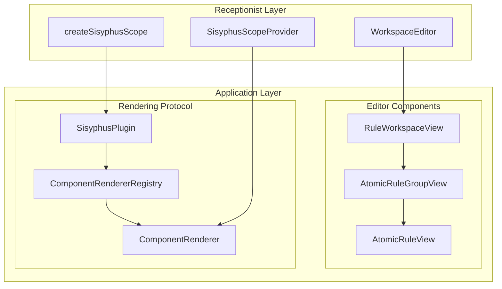

# @sisyphus/react

作为 **框架适配层**，负责将内核 `@sisyphus/core` 提供的 **封装逻辑** 代理渲染为具体的 `UI` 组件

## 前置依赖

- [规则及规则因子描述](../spec.md)
- [规则因子解释器](../interpreter.md)
- [规则配置内核](../core/spec.md)

## 技术栈

- [react19](https://github.com/facebook/react)
- [@preact/signals-react](https://github.com/preactjs/signals/tree/main/packages/react) Signal binding

## 设计目标

- **明确组件库适配协议**：定义框架与组件库适配包之间的契约
- **明确编辑器组件渲染机制**：通过插件代理机制解耦框架与具体 `UI` 实现
- **明确分层架构**：区分业务方直接使用的接入层与内部组件实现的应用层
- **沿用 Composition Pattern**：通过组合而非继承组织编辑器组件层级结构

## 设计约定

- 响应式集成基于 `@preact/signals-react`，作为运行时标准，不纳入分层架构范畴，编辑器组件直接消费 `Signal`
- 编辑器组件与原始 `DSL` 无关联关系，仅消费 `@sisyphus/core` 提供的调度器
- 编辑器组件通过 `View` 后缀

### Signal 响应式集成

编辑器组件通过 `@preact/signals-react` 实现 Signal 到 React 的响应式更新。采用手动 `useSignals()` 方式启用信号追踪：

```tsx
import { useSignals } from '@preact/signals-react/runtime';

function EditorComponent({ scheduler }: EditorComponentProps): ReactElement {
  // 必须在组件顶部调用，启用 Signal 依赖追踪
  useSignals();

  // 读取 Signal.value 时，组件会自动订阅变更并重渲染
  const value = scheduler.someSignal.value;
  // ...
}
```

**重要约定**：

- 所有读取 `Signal.value` 的组件必须在函数体顶部调用 `useSignals()`
- 不依赖 Babel transform，确保在任何构建工具下均可正常工作
- `useSignals()` 必须在任何 `Signal.value` 读取之前调用

## 分层架构

- **接入层**：对外暴露业务方直接使用的组件与 `API`，封装内部编辑器组件的实现细节，简化业务方接入成本
- **应用层**：定义编辑器组件协议与渲染机制，通过插件协议与组件库适配包协同完成实际渲染



### 应用层

应用层负责定义编辑器组件协议与渲染机制，编辑器组件本身不持有具体 `UI` 实现，由组件库适配包通过插件协议注册具体实现。

#### 编辑器组件

编辑器组件作为规则编辑视图层级的最小结构单元，用于插件协议注册的组件和渲染器工厂。

##### AtomicRuleView - 原子规则编辑组件

整合 `name`、`operator`、`threshold` 的完整原子规则编辑器，作为规则配置的最小编辑单元：

```ts
interface AtomicRuleViewProperties {
  /** 组件类型标识 */
  readonly type: 'AtomicRuleView';
  /** 业务逻辑实体 */
  readonly scheduler: AtomicRuleScheduler;
}
```

##### AtomicRuleGroupView - 规则组编辑组件

管理多个原子规则编辑器，用于组织同一层级的规则集合：

```ts
interface AtomicRuleGroupViewProperties {
  /** 组件类型标识 */
  readonly type: 'AtomicRuleGroupView';
  /** 业务逻辑实体 */
  readonly scheduler: AtomicRuleGroupScheduler;
}
```

##### RuleWorkspaceView - 工作空间编辑组件

管理多个规则组编辑器，作为规则配置的顶层容器：

```ts
interface RuleWorkspaceViewProperties {
  /** 组件类型标识 */
  readonly type: 'RuleWorkspaceView';
  /** 业务逻辑实体 */
  readonly scheduler: RuleWorkspaceScheduler;
}
```

##### 编辑器组件属性类型别名

```ts
type EditorComponentProperties =
  | AtomicRuleViewProperties
  | AtomicRuleGroupViewProperties
  | RuleWorkspaceViewProperties;
```

#### 渲染机制

采用组件代理机制：`@sisyphus/react` 仅定义编辑器组件的属性协议与渲染契约，具体的 UI 实现由组件库适配包通过 `SisyphusPlugin` 协议注册。

##### ComponentRendererRegistry - 渲染器注册表

```ts
/** 编辑器组件渲染器注册表 */
interface ComponentRendererRegistry {
  /** 注册 AtomicRuleView 组件 */
  registerAtomicRuleView(component: React.ComponentType<AtomicRuleViewProperties>): void;
  /** 注册 AtomicRuleGroupView 组件 */
  registerAtomicRuleGroupView(component: React.ComponentType<AtomicRuleGroupViewProperties>): void;
  /** 注册 RuleWorkspaceView 组件 */
  registerRuleWorkspaceView(component: React.ComponentType<RuleWorkspaceViewProperties>): void;
}
```

##### ComponentRenderer - 渲染器协议

```ts
interface ComponentRenderer {
  /** 渲染编辑器组件属性 */
  render(props: EditorComponentProperties): React.ReactElement;
}
```

##### SisyphusContext - 插件上下文

```ts
/** Sisyphus 上下文（插件可访问） */
interface SisyphusContext {
  /** 组件渲染器注册表 */
  readonly registry: ComponentRendererRegistry;
}
```

##### SisyphusPlugin - 插件协议

定义框架与组件适配包之间的契约，由组件库适配包（如 `@sisyphus/antd`）实现：

```ts
/** 组件渲染器插件 */
interface SisyphusPlugin {
  /** 插件名称 */
  name: string;
  /** 安装插件 */
  install(context: SisyphusContext): void;
}
```

**组件库适配层职责**：

- 注册编辑器组件实现（`AtomicRuleView`、`AtomicRuleGroupView`、`RuleWorkspaceView`）
- 实现表单组件渲染（`Thresholder`）

### 接入层

接入层封装应用层的实现细节，对业务方暴露最少认知成本的 `API`：业务方仅需感知 `WorkspaceEditor`、`SisyphusScopeProvider` 与 `createSisyphusScope`

#### createSisyphusScope - 创建应用实例

通过 `createSisyphusScope` 工厂函数创建 `SisyphusScope` 实例，业务方通过传入插件列表完成组件库的注册：

```ts
/** Sisyphus 实例化参数 */
interface SisyphusScopeOptions {
  /** 安装组件渲染器插件 */
  plugins: readonly SisyphusPlugin[];
}

interface SisyphusScope {
  /** 获取组件渲染器 */
  renderer(): ComponentRenderer;
}

/** 创建 Sisyphus 应用实例 */
function createSisyphusScope(options: SisyphusScopeOptions): SisyphusScope;
```

#### SisyphusScopeProvider - 作用域提供者

将 `SisyphusScope` 注入 `React` 上下文，供内部编辑器组件通过 `Hook` 获取渲染器：

```ts
interface SisyphusScopeProviderProps {
  /** Sisyphus 应用实例 */
  scope: SisyphusScope;
  /** 子元素 */
  children: React.ReactNode;
}

function SisyphusScopeProvider(props: SisyphusScopeProviderProps): React.ReactElement;
```

#### WorkspaceEditor - 业务方入口组件

`WorkspaceEditor` 是业务方直接使用的顶层组件，封装了内部编辑器组件的实现细节：

```ts
import { RuleWorkspaceScheduler } from '../core/spec.md';

interface WorkspaceEditorProps {
  /** 工作空间实例 */
  workspace: RuleWorkspaceScheduler;
}

function WorkspaceEditor(props: WorkspaceEditorProps): React.ReactElement;
```

**说明**：`WorkspaceEditor` 内部渲染 `RuleWorkspaceView`，业务方无需感知具体的编辑器组件实现。

## 技术支持

### useSisyphusScope - 获取作用域实例

供编辑器组件从 `React` 上下文中获取 `SisyphusScope`，进而取到 `ComponentRenderer` 进行代理渲染：

```ts
function useSisyphusScope(): SisyphusScope;
```

## 使用示例

业务方仅感知接入层 `API`：通过 `createSisyphusScope` 创建实例、`SisyphusScopeProvider` 注入作用域、`WorkspaceEditor` 渲染顶层编辑器：

```tsx
import { SisyphusScopeProvider, WorkspaceEditor, createSisyphusScope } from '@sisyphus/react';
import { createAntdPlugin } from '@sisyphus/antd';

// 创建应用实例
const scope = createSisyphusScope({
  plugins: [createAntdPlugin()],
});

// 业务方仅需关注 WorkspaceEditor，无需感知内部渲染细节
function App() {
  return (
    <SisyphusScopeProvider scope={scope}>
      <WorkspaceEditor workspace={workspace} />
    </SisyphusScopeProvider>
  );
}
```
