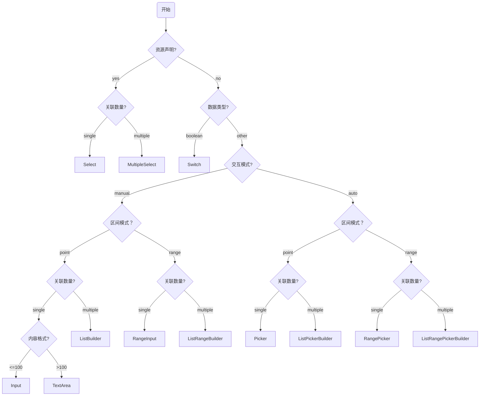

# 规则因子描述

## 业务目标

基于 `json` 设计 `DSL` 用以描述 **规则因子** 语义化结构，**规则配置器** 通过解释 **规则因子描述** 提供可交互视图，用以配置业务规则。`DSL` 设计的核心在于 **规则配置器** 能构基于 **规则因子描述** 推断合适的 **表单控件**、**匹配操作符** 选择范围，以及正确的边界值约束条件

## 业务集成

**规则因子** 与 **规则配置器** 为紧密协同关系，作为 **规则配置中心** 组成要素，规则配置器基于 **规则因子描述** 提供配置器，用户按需配置规则因子形成 **业务规则**。

## 设计原则

设计核心在于描述规则因子的 **元模型**，而非具体的规则实例，必须遵循核心原则：

- **声明式**：描述 `What`，而非 `How`，设计产出不应该包含任何技术实现细节
- **语义驱动 UI**：描述语义，而非 `UI` 结构，设计阶段不应该假设 **框架** 或者 **组件库**

## 规则因子描述设计

### 基础信息

描述规则因子的元信息：

- `name` 规则因子名称，具备唯一性
- `title` 规则因子名称
- `description` 规则因子描述

```json
{
  "name": "deliver_city",
  "title": "目标城市",
  "description": "选择可发送快递的目标城市"
}
```

### 关联资源 Resource

`Resource` 定义可选范围，限制有限范围内进行，支持静态选项、动态选项，可选集合使用统一数据结构：

```ts
interface FieldDataSource {
  label: string;
  value: string | number;
}
```

静态资源描述：

- `name` 资源名称，具备唯一性
- `options` 资源列表，遵循数据结构约束

静态资源接口声明：

```ts
interface StaticResource {
  // 约定的资源名称
  name: string;
  // 预设的可选项
  options: FieldDataSource[];
}
```

静态资源案例：

```json
{
  "resource": {
    "name": "City",
    "options": [
      { "label": "北京", "value": "bj" },
      { "label": "上海", "value": "sh" }
    ]
  }
}
```

**动态资源** 为从服务端下发的数据源，根据数据源特性区分亚型：

- 是否分页输出
- 是否支持关键词过滤

动态资源描述：

- `name` 资源名称，具备唯一性，供应方约定
- `features` 资源供应商支持的特性，例如：分页、关键词过滤

动态资源接口声明：

```ts
type DynamicResourceFeature = 'pagination' | 'filter';

interface DynamicResource {
  // 约定的资源名称
  name: string;
  // 资源供应商支持的特性
  features: DynamicResourceFeature[];
}
```

动态资源案例：

```json
{ "resource": { "name": "City" } }
```

```json
{
  "resource": {
    "name": "Employees",
    "features": ["pagination", "filter"]
  }
}
```

### 数据元属性

- `dataType` 原始数据类型，支持：`string` / `number` / `boolean`
- `mode` 声明单点值或者区间值，支持：`point` / `range`
- `quantity` 声明多值或者单值，支持：`single` / `multiple`
- `semantic` 语义化场景，作为原始数据类型的精细化扩充

`mode` + `quantity` 正交逻辑：

| mode    | quantity   | 业务含义     | 匹配逻辑                           |
| :------ | :--------- | :----------- | :--------------------------------- |
| `point` | `single`   | 单个值       | `target = value`                   |
| `point` | `multiple` | 多个离散值   | `target in [v1, v2]`               |
| `range` | `single`   | 单个连续区间 | `min <= target <= max`             |
| `range` | `multiple` | 多个离散区间 | `(t between r1) or (t between r2)` |

`semantic` 语义化场景支持：

- `rate`
- `date`
- `time`
- `duration`
- `percentage`

### 数据约束与校验

`constraints` 用于定义边界值的校验规则

| 约束字段           | 适用类型        | 说明              |
| :----------------- | :-------------- | :---------------- |
| `min`              | number / string | 最小值 / 最小长度 |
| `max`              | number / string | 最大值 / 最大长度 |
| `exclusiveMinimum` | number / string | 最小值 / 最小长度 |
| `exclusiveMaximum` | number / string | 最大值 / 最大长度 |
| `step`             | number          | 步长              |
| `precision`        | number          | 小数精度          |
| `format`           | string          | 字符串格式        |
| `pattern`          | string          | 正则表达式校验    |

特别说明：最大值，最小值约定：开区间 `(exclusiveMinimum, exclusiveMaximum)`，闭区间 `[min, max]`

**多值场景** 的约束如下，约定闭区间：`[minItems, maxItems]`

| 约束字段   | quantity   | 说明     |
| :--------- | :--------- | :------- |
| `minItems` | `multiple` | 最少数量 |
| `maxItems` | `multiple` | 最大数量 |

## 推断规则因子 Operator

推断逻辑：根据 `dataType` + `semantic` 确定“数据域”，再结合 `mode`（点/区间）和 `quantity`（单/多）确定“操作域”，从而锁定可用的 `operator` 列表

### 数据类型推断 DataType

| dataType | mode  | quantity | 推断的 Operator 语义                                              |
| :------- | :---- | :------- | :---------------------------------------------------------------- |
| number   | point | single   | `=`, `≠`, `>`, `>=`, `<`, `<=`                                    |
| number   | point | multiple | `in`, `not in`                                                    |
| number   | range | single   | `between`, `not between`                                          |
| number   | range | multiple | `between any`, `betwen all`, `not between any`, `not between all` |
| string   | point | single   | `=`, `≠`, `contains`, `within`, `starts_with`, `ends_with`        |
| string   | point | multiple | `in`, `not in`                                                    |
| boolean  | point | single   | `is`                                                              |

### 场景类型推断 Semantic

以下 `Semantic` 本质上遵循 `dataType=number` 的 `operator` 推断逻辑：

- `rate`
- `date`
- `time`
- `datetime`
- `duration`
- `percentage`

## 推断抽象组件 Intermediate Representation

从 `DSL` 推断中间形态的抽象组件，便于适配器（框架 + 组件库）进行高效的实现



组件说明：

- `Input`: 单行文本/数字输入
- `TextArea`: 长文本输入
- `RangeInput`: 区间输入
- `Select`: 单选
- `MultipleSelect`: 多选
- `Picker`: 数值或日期的选择
- `RangePicker`: 数值或日期的区间选择
- `ListBuilder`: 列表构建器
- `ListRangeBuilder`: 区间列表构建器
- `ListPickerBuilder` 本质上为 `ListBuilder`，语义上适用于 `Picker` 场景
- `ListRangePickerBuilder` 本质上为 `ListRangeBuilder`，语义上适用于 `Picker` 场景

## 规则配置

### 规则配置业务概念

- **原子规则**：最小粒度的规则语义模型，包含：匹配目标、匹配方式、匹配阈值
- **规则组**：使用逻辑 **AND** 连接多个 **原子规则** 形成规则组，作为 **规则引擎** 执行时的规则单元

```ts
// 原则规则
interface AtomicRule<T> {
  // 无业务语义，仅作为存储唯一标识
  id: string;
  // 目标数据，基于业务语义命名，例如：DEVICE_ID, NETWORK_SECURITY_LEVEL，必须与“规则因子定义**中的名称一致
  name: string;
  // 匹配方式，定义比较的逻辑行为，例如：BETWEEN, IN, GT
  operator: string;
  // 匹配阈值
  threshold: T;
}
```

### 规则配置约束

- 配置 **规则组** 时，特定 **规则因子** 仅允许配置一次
  - 推断 **原子规则** 最大数量等同于 **规则因子** 的数量
- 配置 **原子规则** 时，如果 **规则因子** 选择变更，需要重置 `Operator` + `Value` 的状态

### 规则配置案例

网络访问规则：访问设备必须位于 **设备白名单** 之内，访问时间必须处于 **工作时段**

```json
[
  {
    "id": "rule-001",
    "name": "DEVICE_ID",
    "operator": "IN",
    "threshold": ["49ccacd5897adb8b3c89a0c78e1765be", "2db3614cbf0b8901be5aaf0507a69d9a"]
  },
  {
    "id": "rule-002",
    "name": "ACCESS_TIME",
    "operator": "BETWEEN",
    "threshold": ["09:30:00", "18:30:00"]
  }
]
```
